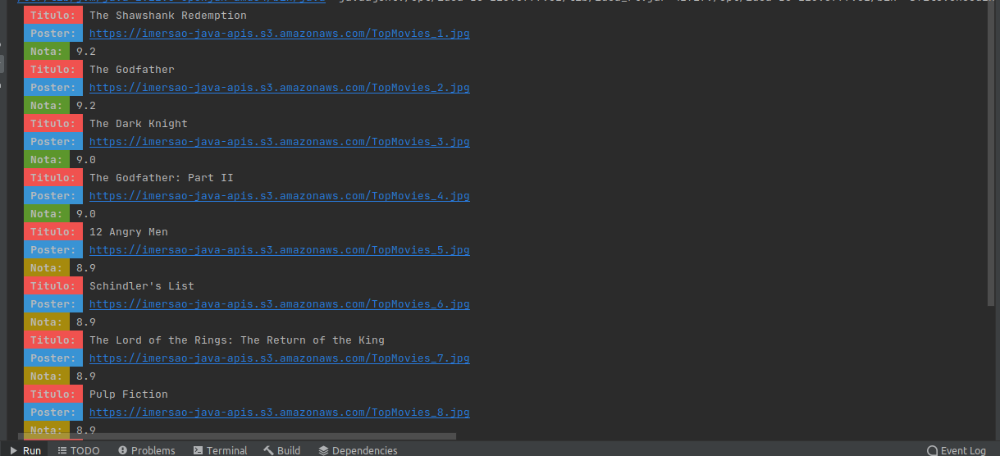

<h1 align="center"> Imersão JAVA ALURA </h1>

## Descrição do Projeto

Projeto desenvolvido durante a Imersão JAVA da Alura. Durante a imersão JAVA vamos utilizar uma API do IMDB para requisitar os
**TOP250 Filmes** e **Filmes mais populares**. Com esta resposta pretendemos personalizar
a saída para exibir de melhor forma.

---

## Aula 1 - Construindo uma API de Filmes

<h4 align="center"> 
    :construction:  Projeto em construção  :construction:
</h4>

Nesta aula vimos como chamar um endpoint da API IMDB e fomos desafiados a personalizar
o resultado exibindo no terminal em cores diferentes e utilizando imagens.

### Desafios Aula 1

1. Consumir o endpoint de filmes mais populares da API do IMDB. Procure também, na documentação da API do IMDB, o endpoint que retorna as melhores séries e o que retorna as séries mais populares.
2. Usar sua criatividade para deixar a saída dos dados mais bonitinha: usar emojis com código UTF-8, mostrar a nota do filme como estrelinhas, decorar o terminal com cores, negrito e itálico usando códigos ANSI, e mais!
3. Colocar a chave da API do IMDB em algum lugar fora do código como um arquivo de configuração (p. ex, um arquivo .properties) ou uma variável de ambiente
4. Mudar o JsonParser para usar uma biblioteca de parsing de JSON como Jackson ou GSON
5. Desafio supremo: criar alguma maneira para você dar uma avaliação ao filme, puxando de algum arquivo de configuração OU pedindo a avaliação para o usuário digitar no terminal.

---

## Aua 2 - Gerando figurinhas para WhastApp

<h4 align="center"> 
    :construction:  Projeto em construção  :construction:
</h4>

Nesta aula aprendemos como personalizar as imagens (Poster dos filmes) de retorno da API
incluindo um texto ao final da imagem e criando um sticker para utilizar, por exemplo, 
no WhatsApp ou outro sistema de mensagens.

### Desafios Aula 2

1. Ler a documentação da classe abstrata InputStream.
2. Centralizar o texto na figurinha.
3. Fazer um pacote no Whatsapp e/ou Telegram com as suas próprias figurinhas!
4. Criar diretório de saída das imagens, se ainda não existir.
5. Colocar outra fonte como a Comic Sans ou a Impact, a fonte usada em memes.
6. Colocar uma imagem de você que está fazendo esse curso sorrindo, fazendo joinha!
7. Colocar contorno (outline) no texto da imagem.
8. Tratar as imagens retornadas pela API do IMDB para pegar uma imagem maior ao invés dos thumbnails. Opções: pegar a URL da imagem e remover o trecho mostrado durante a aula ou consumir o endpoint de posters da API do IMDB (mais trabalhoso), tratando o JSON retornado.
9. Fazer com que o texto da figurinha seja personalizado de acordo com as classificações do IMDB.
10. Desafio supremo: usar alguma biblioteca de manipulação de imagens como OpenCV pra extrair imagem principal e contorná-la.

---

## Aua 3 - Ligando as pontas, refatoração e Orientação a Objetos

<h4 align="center"> 
    :construction:  Projeto em construção  :construction:
</h4>

### Desafios Aula 3

1. Transformar a classe que representa os conteúdos em um Record, disponível a partir do Java 16
2.Criar as suas próprias exceções e usá-las na classe que implementa o cliente HTTP
3.Usar recursos do Java 8 e posterior, como Streams e Lambdas, para mapear uma lista em uma outra
4. Criar uma Enum que une, como configurações, a URL da API e o extrator utilizado
5. Desafio supremo: consumir outras APIs que contém imagens, como a da Marvel, que é bem diferente. Repositório com APIs públicas: [clique aqui](https://github.com/public-apis/public-apis).

---

## Aua 4 - Criando nossa própria API com Spring

<h4 align="center"> 
    :construction:  Projeto em construção  :construction:
</h4>

### Desafios Aula 4

1. Finalizar o CRUD (Create, Read, Update e Delete) para que se possa atualizar e excluir uma linguagem cadastrada;
2. Devolver a listagem ordenada pelo ranking;
3. Criar na sua API um modelo de entidade com nomes diferentes de title e image e criar seu próprio extrator de informações personalizado OU, manter com o nome title e image e traduzir para que seja retornado como título e imagem através do uso de DTO (Data Transfer Object);
4. Retornar o status 201 quando um recurso (linguagem, no nosso caso) for cadastrado através do POST;
5. Desafio supremo: Aplicar modificações parciais no recurso através do método PATCH, por exemplo, modificando o número de votos ou de pessoas que utilizam cada linguagem de programação.

---

## Aua 5 - Publicando nossa API na Cloud

<h4 align="center"> 
    :construction:  Projeto em construção  :construction:
</h4>

### Desafios Aula 5

1. Compartilhe com seus amigos a sua URL do Heroku, para que eles possam consumir a sua API (com o padrão de atributos title e image) e gerar figurinhas do conteúdo que você utilizou (linguagens de programação, filmes, músicas);
2. Colocar a aplicação no cloud da Oracle;
3. Implementar algum mecanismo de votação na API, para que outros amigos votem nas linguagens preferidas para que se possa fazer um ranking;
4. Desafio supremo: Evoluir o projeto das três primeiras aula para que ele gere um bundle de stickers, para que se possa fazer o download e já incluir vários stickers no WhatsApp; Usar os conhecimentos aprendidos em alguma imersão React da Alura e fazer uma aplicação front-end para gerar esse bundle, onde possa se passar a URL do conteúdo e já visualizar os stickers;
